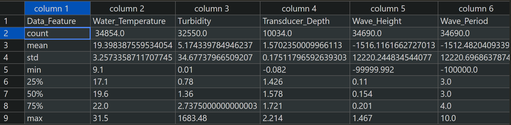
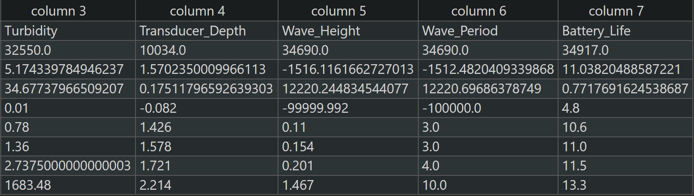
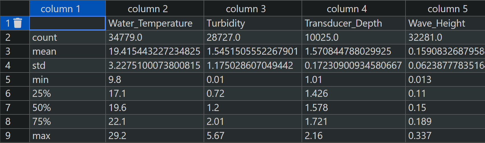
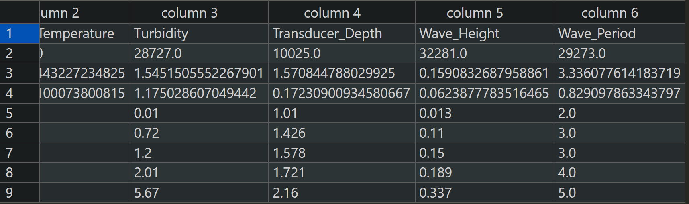

# 大数据挖掘
## 天气自动传感器大数据
### 数据处理思路


先分析数据分布情况，然后进行数据清洗，最后进行特征工程。
### 数据分布
采用pandas库进行数据分析
使用pandas库的describe()方法进行数据描述。
得到数据量，均值，中位数，最大值，最小值，四分位数，标准差等信息。
```python
import pandas as pd
df = pd.read_csv('data.csv')
df.describe()
```
#### 分类方法说明
<font size=1>
1.数据类型：首先要了解数据的类型是离散型还是连续型。如果数据是离散型的，可以考虑使用决策树、朴素贝叶斯等方法。如果数据是连续型的，可以考虑使用支持向量机、逻辑回归等方法。

2.特征数量：特征数量是选择分类方法的重要考虑因素之一。如果特征数量较少，可以考虑使用简单的分类方法，如决策树、朴素贝叶斯等。如果特征数量较多，可以考虑使用随机森林、支持向量机等方法。

3.特征之间的相关性：特征之间的相关性也是选择分类方法的重要因素。如果特征之间存在较强的相关性，可以考虑使用线性分类方法，如逻辑回归、支持向量机等。如果特征之间的相关性较弱或不明显，可以考虑使用非线性分类方法，如决策树、随机森林等。

3.样本数量：样本数量也是选择分类方法的重要考虑因素之一。如果样本数量较少，可以考虑使用简单的分类方法，如朴素贝叶斯、支持向量机等。如果样本数量较多，可以考虑使用复杂的分类方法，如深度学习模型等。


#### 清洗前


Wave_Height标准差为12220.244834544077很大，需要特殊处理
Wave_Period的标准差为12220.69686378749也很大，需要特殊处理
如果数据点比第一个四分位数低 1.5 乘 IQR，或比第三个四分位数高 1.5 乘 IQR，就属于离群或极度离群
```python
df = pd.read_csv('data.csv')
Wave_Height__Period=df.iloc[:,2:7]
Q1 = Wave_Height__Period.quantile(0.25)
Q3 = Wave_Height__Period.quantile(0.75)
IQR = Q3 - Q1
df_no_outliers = Wave_Height__Period[~((Wave_Height__Period < (Q1 - 1.5 * IQR)) | (Wave_Height__Period > (Q3 + 1.5 * IQR)))]


```
#### 清洗后


标准差恢复正常

数据清洗完毕

#### 分类方法选择
样本数量在一到三万左右，
特征数量在4左右，
数据离散，
特征选取Water_Temperature、Turbidity、Wave_Height、Wave_Period，特征间关联不明显。

数据离散，排除支持向量机、逻辑回归
数据特征较少

选择随机森林或决策树
<font size=1>

决策树：

1. 样本数量：对于样本数量在一到三万左右的数据集，决策树是一个适用的分类算法。决策树算法在处理中等规模的数据集时具有良好的性能，并且可以快速构建模型。

2. 特征数量：特征数量为4个，这是一个相对较少的数量。决策树算法适用于特征数量较少的情况，因为它可以通过对每个特征的不同取值进行划分来构建决策树，从而进行分类。

3. 数据离散：决策树算法可以很好地处理离散数据。对于您的数据集，如果特征是离散的，决策树可以通过选择最佳的划分特征和取值来构建决策树，实现分类。

4. 特征选择：决策树算法可以通过特征选择来确定最具有分类能力的特征。在您的情况下，如果特征之间的关联不明显，决策树可以通过对每个特征的取值进行划分来选择最佳的特征，从而构建具有较高分类准确性的决策树模型。


随机森林：

1. 样本数量：随机森林算法在处理样本数量较大的数据集时表现良好。由于随机森林是通过集成多个决策树的预测结果来进行分类的，因此对于样本数量在一到三万左右的数据集，随机森林可以有效地提高分类准确性。

2. 特征数量：即使特征数量较少，随机森林仍然可以发挥优势。随机森林通过随机选择特征子集进行建立，减少了特征选择的复杂性。在您的情况下，特征数量为4个，适合使用随机森林算法进行分类。

3. 数据离散：随机森林算法对于离散数据具有良好的适应性。对于您的离散数据，随机森林可以通过选择最佳的划分特征和取值来构建决策树，从而实现分类。

4. 特征间关联不明显：即使特征之间的关联不明显，随机森林仍然可以发挥作用。由于随机森林是通过集成多个决策树的预测结果进行分类的，即使特征间的关联不明显，随机森林可以通过综合多个决策树的预测结果来提高分类准确性。


</font>


### 数据处理形式
接口：
```python
X = np.array([[5.1, 3.5, 1.4, 0.2],
              [4.9, 3.0, 1.4, 0.2],
              [4.7, 3.2, 1.3, 0.2],
              [7.0, 3.2, 4.7, 1.4],
              [6.4, 3.2, 4.5, 1.5]])


y = np.array([0, 0, 0, 1, 1])
```

先把缺失值用平均值填充
```python
def Dict_to_list(self,data_dict):#用均值填充NaN
X = []
Y = []
X_average ={}
X_median = {}
for key,values in data_dict.items():
    index_num=[]
    X_Temp=[]
    for index, element in enumerate(values):
        if math.isnan(element):
            index_num.append(index)
        else:
            X_Temp.append(element)
    if X_Temp != []:
        X_average[key]=np.mean(X_Temp)
        X_median[key]=np.median(X_Temp)
    else:
        X_average[key]=0
        X_median[key]=0
    if index_num != []:#有NaN,马上替换
        for index in index_num:
            values[index]=X_average[key] 

    X.append(values)
    Y.append([key]*len(values))

# X = np.array(X)
#Y = np.array(Y)
print("Yes,Dict_to_list complete!")
return X,Y


```
然后构造X,y接口

