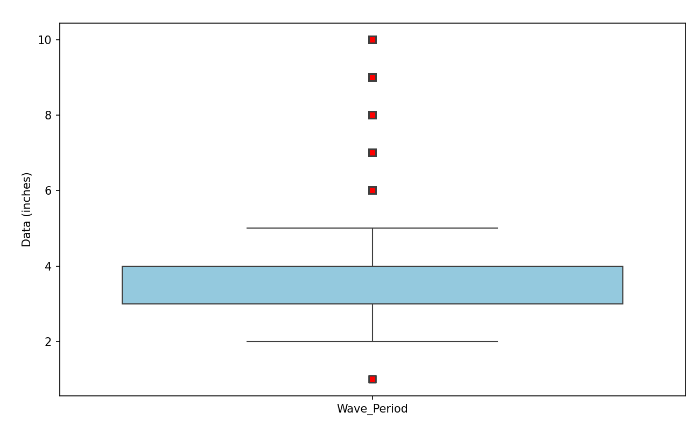
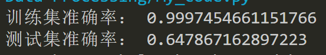
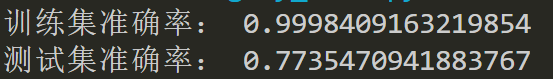

# 大数据挖掘
## 天气自动传感器大数据
## ------------------------------------12/4 第一次答辩分界线------------------------------------
### 数据处理思路


先分析数据分布情况，然后进行数据清洗，最后进行分类
### 数据分布
采用pandas库进行数据分析
使用pandas库的describe()方法进行数据描述。
```python
import pandas as pd
df = pd.read_csv('data.csv')
df.describe()
```
得到数据量，均值，中位数，最大值，最小值，四分位数，标准差等信息。

Wave_Height标准差为12220.244834544077很大，需要特殊处理
Wave_Period的标准差为12220.69686378749也很大，需要特殊处理
可视化，得到各个数据的盒图



```python
def Box_Plot(dataFrame):
    # 创建一个指定大小的图像
    plt.figure(figsize=(10, 6))
    # 绘制盒图
    columns_to_process = ['Water_Temperature']
    sb.boxplot(dataFrame[columns_to_process],color='skyblue',flierprops=dict(markerfacecolor='r', marker='s'))
    # 设置y轴标签
    plt.ylabel("Data (inches)")
    # 显示盒图
    plt.show()
```
按月份将六个沙滩的Wave_Height 和Wava_period 绘制折线图

```python
def Time_Plot(data):
    Beach_Name = ['Montrose Beach', 'Ohio Street Beach',
                  'Calumet Beach', '63rd Street Beach', 'Osterman Beach', 'Rainbow Beach']

    plt.figure(figsize=(10, 6))  # Create a single figure

    line_styles = ['-', '--', '-.', ':', '-.', '--']  # Define line styles
    line_colors = ['blue', 'orange', 'green', 'red', 'purple', 'brown']  # Define line colors

    for i, beach_name in enumerate(Beach_Name):
        dataFrame = data.loc[data['Beach_Name'] == beach_name]
        dataFrame['Measurement_Date_And_Time'] = pd.to_datetime(dataFrame['Measurement_Date_And_Time'])
        dataFrame['月份'] = dataFrame['Measurement_Date_And_Time'].dt.strftime('%Y-%m')
        columns_to_process = ['Wave_Height', 'Wave_Period']
        monthly_data = dataFrame.groupby('月份')[columns_to_process].mean()

        plt.plot(monthly_data.index, monthly_data['Wave_Height'], linestyle=line_styles[i], color=line_colors[i], label=beach_name + ' Wave_Height')
        plt.plot(monthly_data.index, monthly_data['Wave_Period'], linestyle=line_styles[i], color=line_colors[i], label=beach_name + ' Wave_Period')

    plt.title('Time_Data')
    plt.xlabel('Month')
    plt.ylabel('Mean')
    plt.legend()
    plt.show()
```


### 数据处理
不是对一列数据进行处理，而是对属于每个海滩的各个特征进行处理

因为每个沙滩的情况不一样，所以需要对每个沙滩进行处理
```python
Wave_Height = pd.DataFrame.from_dict(Wave_Height_label_dict,orient='index')
Wave_Height.to_csv('Wave_Height.csv')
Wave_Height.apply(pd.Series.describe, axis=1).to_csv('Wave_Height_Features.csv')

Wave_Period = pd.DataFrame.from_dict(Wave_Period_label_dict,orient='index')
Wave_Period.to_csv('Wave_Period.csv')
Wave_Period.apply(pd.Series.describe, axis=1).to_csv('Wave_Period_Features.csv')
```
Wave_Height:

Wave_Period:

可以发现Ohio Street Beach、63rd Street Beach、Rainbow Beach三个沙滩的海滩高度和周期有异常值


用均值填充缺失数据和离群负值
```python
# 读取CSV文件
df = pd.read_csv('data.csv')
# 指定需要计算均值和填充的列
columns_to_process = ['Water_Temperature', 'Turbidity', 'Wave_Height','Wave_Period']
# 计算均值
mean_values = df[columns_to_process].\
apply(lambda x: np.mean(x[x >= 0]), axis=0)
# 填充负值和NaN值
df[columns_to_process] = df[columns_to_process].\
apply(lambda x: x.mask((x < 0) | x.isna(), mean_values[x.name]), axis=0)
# 将结果保存回原CSV文件
df.to_csv('Data.csv', index=False)
```
填充之后的月份折线图：


### 分类

最终接口：
```python
X = np.array([[5.1, 3.5, 1.4, 0.2],
              [4.9, 3.0, 1.4, 0.2],
              [4.7, 3.2, 1.3, 0.2],
              [7.0, 3.2, 4.7, 1.4],
              [6.4, 3.2, 4.5, 1.5]])


y = np.array([0, 0, 0, 1, 1])
```


构造X,y接口：


先把数据格式处理为：{'Montrose Beach':[1,2,3,4],'Ohio Street Beach':[1,2,3,4],'Calumet Beach':[1,2,3,4],'63rd Street Beach':[1,2,3,4]}
然后
处理为
X=[[1,2,3,4],[1,2,3,4],[1,2,3,4],[1,2,3,4]]
y=[['Montrose Beach'],['Ohio Street Beach'],['Calumet Beach'],['63rd Street Beach']]
```python
data = {'Montrose Beach':[1,2,3,4],'Ohio Street Beach':[1,2,3,4],'Calumet Beach':[1,2,3,4],'63rd Street Beach':[1,2,3,4]}
X = []
y = []
for key, value in data.items():
    X.append(value)
    y.append([key])
```
```python
def Features_Get(data):
    Features_label_dict = {}

    i=0
    for index,row in data.iterrows():#遍历每一行
        Beach_Name_key = row.iloc[0]
        Features_values_Water_Temperature = row.iloc[2]
        Features_values_Turbidity = row.iloc[3]
        Features_values_Wave_Height = row.iloc[5]
        Features_values_Wave_Period = row.iloc[6]


        if Beach_Name_key in Features_label_dict:
            Features_label_dict[Beach_Name_key].append(Features_values_Water_Temperature)
            Features_label_dict[Beach_Name_key].append(Features_values_Turbidity)
            Features_label_dict[Beach_Name_key].append(Features_values_Wave_Height)
            Features_label_dict[Beach_Name_key].append(Features_values_Wave_Period)
        else:
            Features_label_dict[Beach_Name_key]=[Features_values_Water_Temperature,Features_values_Turbidity,Features_values_Wave_Height,Features_values_Wave_Period]
    
        i+=1
        if i==3:
            break
        
    print(Features_label_dict)
    print("Yes,data cleaning complete!")
    return Features_label_dict
```
#### 分类方法说明
<font size=1>
1.数据类型：首先要了解数据的类型是离散型还是连续型。如果数据是离散型的，可以考虑使用决策树、朴素贝叶斯等方法。如果数据是连续型的，可以考虑使用支持向量机、逻辑回归等方法。

2.特征数量：特征数量是选择分类方法的重要考虑因素之一。如果特征数量较少，可以考虑使用简单的分类方法，如决策树、朴素贝叶斯等。如果特征数量较多，可以考虑使用随机森林、支持向量机等方法。

3.特征之间的相关性：特征之间的相关性也是选择分类方法的重要因素。如果特征之间存在较强的相关性，可以考虑使用线性分类方法，如逻辑回归、支持向量机等。如果特征之间的相关性较弱或不明显，可以考虑使用非线性分类方法，如决策树、随机森林等。

3.样本数量：样本数量也是选择分类方法的重要考虑因素之一。如果样本数量较少，可以考虑使用简单的分类方法，如朴素贝叶斯、支持向量机等。如果样本数量较多，可以考虑使用复杂的分类方法，如深度学习模型等。
#### 分类方法选择
样本数量在一到三万左右，
特征数量在1-6，
数据离散，
特征选取Water_Temperature、Turbidity、Wave_Height、Wave_Period，特征间关联不明显。

数据离散，排除支持向量机、逻辑回归
数据特征较少

选择随机森林或决策树
<font size=1>

决策树：

1. 样本数量：对于样本数量在一到三万左右的数据集，决策树是一个适用的分类算法。决策树算法在处理中等规模的数据集时具有良好的性能，并且可以快速构建模型。

2. 特征数量：特征数量为4个，这是一个相对较少的数量。决策树算法适用于特征数量较少的情况，因为它可以通过对每个特征的不同取值进行划分来构建决策树，从而进行分类。

3. 数据离散：决策树算法可以很好地处理离散数据。对于您的数据集，如果特征是离散的，决策树可以通过选择最佳的划分特征和取值来构建决策树，实现分类。

4. 特征选择：决策树算法可以通过特征选择来确定最具有分类能力的特征。在您的情况下，如果特征之间的关联不明显，决策树可以通过对每个特征的取值进行划分来选择最佳的特征，从而构建具有较高分类准确性的决策树模型。


随机森林：

1. 样本数量：随机森林算法在处理样本数量较大的数据集时表现良好。由于随机森林是通过集成多个决策树的预测结果来进行分类的，因此对于样本数量在一到三万左右的数据集，随机森林可以有效地提高分类准确性。

2. 特征数量：即使特征数量较少，随机森林仍然可以发挥优势。随机森林通过随机选择特征子集进行建立，减少了特征选择的复杂性。在您的情况下，特征数量为4个，适合使用随机森林算法进行分类。

3. 数据离散：随机森林算法对于离散数据具有良好的适应性。对于您的离散数据，随机森林可以通过选择最佳的划分特征和取值来构建决策树，从而实现分类。

4. 特征间关联不明显：即使特征之间的关联不明显，随机森林仍然可以发挥作用。由于随机森林是通过集成多个决策树的预测结果进行分类的，即使特征间的关联不明显，随机森林可以通过综合多个决策树的预测结果来提高分类准确性。

</font>

#### 选择决策树进行分类
```python
def train_and_evaluate_decision_tree(X, y):
    """
    使用输入的特征数据和目标数据训练决策树模型，并计算训练集和测试集的准确率
    参数：
    X: 特征数据
    y: 目标数据
    返回：
    训练集和测试集的准确率
    """
    # 将数据集划分为训练集和测试集
    X_train, X_test, y_train, y_test = train_test_split(X, y, test_size=0.1, random_state=42)
    # 实例化决策树分类器
    clf = DecisionTreeClassifier()
    # 使用训练集数据拟合模型
    clf.fit(X_train, y_train)
    # 使用训练集数据进行预测
    y_train_pred = clf.predict(X_train)
    # 使用测试集数据进行预测
    y_test_pred = clf.predict(X_test)
    # 计算训练集和测试集的准确率
    train_accuracy = metrics.accuracy_score(y_train, y_train_pred)
    test_accuracy = metrics.accuracy_score(y_test, y_test_pred)
    # 返回训练集和测试集的准确率
    return train_accuracy, test_accuracy
```
当特征值选取典型的四个值'Water_Temperature', 'Turbidity', 'Wave_Height','Wave_Period'：

准确率：

增加特征值:'Transducer_Depth'

在增加特征值'Battery_Life'：

Transducer_Depth、Battery_Life为什么与准确率有关？
可能是不同沙滩测量采用的传感器种类不同，沙滩深浅不同，所以传感器的埋藏深度不同。

### 问题
训练效果很好，测试准确率太低，过拟合

岛屿上的沙滩可能挨得比较近，所以可能影响分类结果，考虑取两片数值差异较大的沙滩进行分类。

### 他人
为旅游人群、季节给出建议。
### 解决方案
调参

### 下一步
研究周期与水温-季节、月份的关系

## 最终准备 
----------------------------------------------------------------------

### 思路-02

### 问题
如何给出旅游人群、季节给出建议？

### 背景
旅游人群：
- 10岁以下
- 10-20岁
- 20-30岁
- 30-40岁
- 40-50岁
- 50-60岁
- 60-70岁
- 70-80岁
- 80岁以上

季节：
- 春季
- 夏季
- 秋季
- 冬季

### 要求
给出旅游人群、季节给出建议

### 解决方案
调参

### 下一步
研究周期与水温-季节、月份的关系

### 参考资料