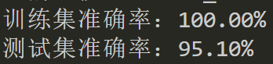
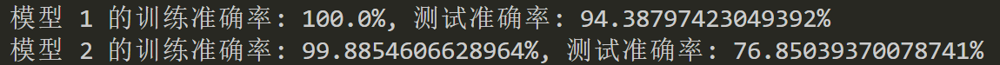

# 大数据挖掘
## 天气自动传感器大数据
## 
------------------------------------
12/4 更进一步 
------------------------------------
### 准确率太低的问题
#### 猜想
均值填充时，用的 是用某个属性整体的均值去替换各个沙滩该属性的值
可能会导致个数据间属性趋于相同。

#### 解决办法 
进行分组填充，且只填充缺失值，不填充负值

效果显著！
然后又进行了负值填充

变化不大，原因是：
<font size=1>
  决策树在处理离群值时通常比较稳健。
  决策树的分裂过程是基于数据集中的比例，而不是绝对值。因此，离群值不太可能对决策树的分裂产生显著影响。在大多数情况下，决策树能够相对稳健地处理离群值，而无需过多的预处理。
</font>

### 联系实际
#### 背景1
<font size=1>

首先，我们需要考虑水温对冲浪者的游玩体验的影响。通常来说，水温对于冲浪者来说是非常重要的。较暖的水温通常更适合初学者，因为它可以提供更舒适的体验，减少体温过低的风险。对于有经验的冲浪者来说，较冷的水温可能更具挑战性，因为他们更能适应这种环境。

其次，浑浊度也会对冲浪者的体验产生影响。较高的浑浊度可能会降低水下能见度，增加冲浪时的不确定性，对初学者来说可能会增加难度。而对于有经验的冲浪者来说，他们可能更能适应这种环境，并且享受在不同条件下冲浪的挑战。

接下来，海滩的波浪高度和波浪周期也是冲浪体验中非常重要的因素。较高的波浪通常更适合有经验的冲浪者，因为他们可以利用这些波浪进行更具挑战性的动作和技巧。而对于初学者来说，较小且更平缓的波浪可能更适合他们练习和学习。

波浪高度：
波浪高度是指从波谷到波峰的垂直距离，通常用英尺或米来描述。
对于冲浪者来说，波浪高度决定了冲浪的难度和刺激程度。较高的波浪更适合有经验的冲浪者，而较低的波浪则更适合初学者。
对于游泳者来说，较高的波浪可能会增加游泳的难度，而较低的波浪则更适合进行休闲游泳和玩耍。
波浪周期：
波浪周期是指两个相邻波峰通过某一点所需的时间，通常以秒为单位。
较短的波浪周期意味着波浪更加频繁，这可能增加游泳和冲浪的难度，尤其是对于初学者来说。
较长的波浪周期意味着波浪更规律，更容易预测，适合进行冲浪和游泳。
因此，对于想要在海滩进行冲浪或游泳的人来说，选择适合自己技能水平的波浪高度和周期非常重要。初学者可以选择较低且规律的波浪，而有经验的冲浪者可能更喜欢挑战较高的波浪。


</font>

#### 考虑


<font size=1>

因此，综合考虑水温，浑浊度，海滩的波浪高度和波浪周期，我们可以得出以下结论：
对于初学者来说，较暖、清澈的水域和较小、平缓的波浪可能更适合他们的学习和体验。
对于有经验的冲浪者来说，他们可能更能适应不同条件下的挑战，包括较冷、浑浊的水域和较高、更具挑战性的波浪。

在六个沙滩中，找出适合自己技能水平的波浪高度和波浪周期。
plus:最后可以给出游玩季节的建议
</font>

初学者：求稳(数值)

| Water_Temperature|大|
| :----: | :----: |
| Turbidity|小| 
| Wave_Height|小| 
| Wave_Period|大| 

有经验者：(数值)
| Water_Temperature|小|
| :----: | :----: |
| Turbidity|大| 
| Wave_Height|大| 
| Wave_Period|小| 


#### 设计推荐系统(没搞)

还没想出比直接用随机森林更好的办法 (该表格无用)：
|  | 初学者 | 经验者 |
| :-----| ----: | :----: |
|  数值 1| 可，不建议 | 单元格 |
| 数值2 | 单元格 | 单元格 |
|  数值3| 单元格 | 单元格 |
| 数值4 | 单元格 | 单元格 |

#### 简单预测

将时间数据，转为数值，然后进行训练，得到模型，然后利用模型进行预测，得到适宜冲浪的月份。
```python
        # 在数据中提取月份信息   
        data['Measurement_Date_And_Time'] = pd.to_datetime(data['Measurement_Date_And_Time'])
        # 提取月份信息并存储为新列
        data['Month'] = data['Measurement_Date_And_Time'].dt.month
        #将data['Month'] 数据类型变为str
        data['Month'] = data['Month'].astype(str)
        print("是否有缺失值：",data['Month'].isnull().any())
        data = data.dropna(subset=['Month'])
        print("是否有缺失值：",data['Month'].isnull().any())

```
认为传感器深度为沙滩近岸区高度，利用训练模型，给出建议.

因为随机森林不允许训练方式为多对多，只能将月份和沙滩名分开训练，考虑到同一岛上同一月份的各个沙滩的各维特征具有相似性，分开训练，得到的结果差距应该不大。
X去除了'Battery_Life',选取：
```
X = ['Water_Temperature', 'Turbidity', 'Wave_Height''Wave_Period''Transducer_Depth']
Y = ['Beach_Name','Measurement_Date_And_Time']
```
训练：

```python
   def Random_Forest_Classification_Plus(self,X, Y):
        # 拆分数据集
        X_train, X_test, Y_train, Y_test = train_test_split(X, Y, test_size=0.2, random_state=42)

        # 训练多个独立的随机森林模型
        models = {}
        for column in range(Y.shape[1]):
            rf = RandomForestClassifier()
            rf.fit(X_train, Y_train[:, column])
            models[column] = rf

        # 预测并计算准确率
        train_accuracies = []
        test_accuracies = []
        for column, model in models.items():
            y_train_pred = model.predict(X_train)
            train_accuracy = accuracy_score(Y_train[:, column], y_train_pred)
            train_accuracies.append(train_accuracy)
            y_test_pred = model.predict(X_test)
            test_accuracy = accuracy_score(Y_test[:, column], y_test_pred)
            test_accuracies.append(test_accuracy)
        print("多个独立的随机森林模型训练完成！")
        return [train_accuracies, test_accuracies], models

```
训练结果：



可供输入的特征：

输入：

得到:


